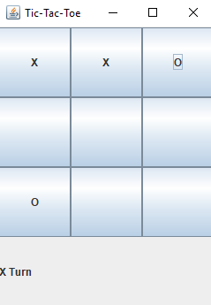
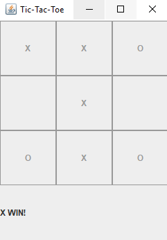

# Tic-Tac-Toe

##Introduction Welcome to TicTacToe! The project was made for a Software Engineering Individual Project. 

##Installation Click here to download the zip folder that contains the program files. If that does not work, click the "Clone or download" button and select the option "Download Zip". Next, find the zip folder in your downloads folder. Unzip the folder to a convenient location. To run this project you can either run the jar file in the main folder.  

  

##Instructions This is a two player game, so find a friend to play aganist! The object of this game is to get three of your character's (either X's or O's) in a row either horrizontally, vertically or diagnally on a 3x3 grid.

The first player to go will be player X. Click on a tile to place your "token" this will end your turn. Player O will then place his/her token and this will continue till either: Player X or Player O gets a 3 in a row or all tiles have been used and there cannont be a winner and this will result in a tie!

##Example Gameplay

  

In this example, Player X places his/her's first token on the Top-Left tile on the grid. It is now Player O's turn.

  

Player O places his/her token in the Bottom-Left tile on the grid.

  

Player X places his/her token in the Top-Middle tile on the grid. Player X now has 2 in a row!

  

Player O places his/her token in the Top-Right tile on the grid to keep Player X from winning next turn, and it also means that Player O just needs the Middle-Middle tile to get 3 in a row!

  

Player X then places his/her token in the Middle-Middle tile to keep O from winning and to garreentee his win! He will either get the win with the middle vertical three in a row or the diagnal from the Top-Left to Bottom-Right.

  

Player O places his/her token in the Bottom-Right tile to keep stop the diagnal win for Player X.

  

Player X places his/her token in the Bottom-Middle tile to get the middle vertical three in a row win condition.

##Acknowledgements

The professor of my Software Engineering course provided the project structure with what classes did what. I wrote the game logic and the GUI.
