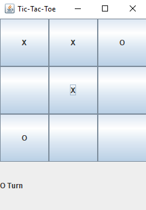

# Tic-Tac-Toe

##Introduction Welcome to TicTacToe! The project was made for a Software Engineering Individual Project.

##Installation Click here to download the zip folder that contains the program files. If that does not work, click the "Clone or download" button and select the option "Download Zip". Next, find the zip folder in your downloads folder. Unzip the folder to a convenient location. To run this project you can either run the jar file in the main folder.  

  

##Instructions This is a two player game, so find a friend to play aganist! The object of this game is to get three of your character's (either X's or O's) in a row either horrizontally, vertically or diagnally on a 3x3 grid.

The first player to go will be player X. Click on a tile to place your "token" this will end your turn. Player O will then place his/her token and this will continue till either: Player X or Player O gets a 3 in a row or all tiles have been used and there cannont be a winner and this will result in a tie!

##Example Gameplay

  

In this example, the X Player's places his/her's first token on the Top-Left tile on the grid. It is not O Player's turn.

  

  

a

  

  

  

  

##Acknowledgements

The professor of my C++ course provided the random number generator and player input functions for this assignment. I wrote the game logic, secret code generator, and header file. The title was made using a text-to-ASCII-art generator found on this website.
